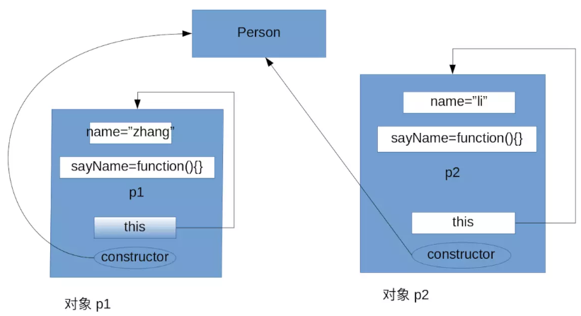
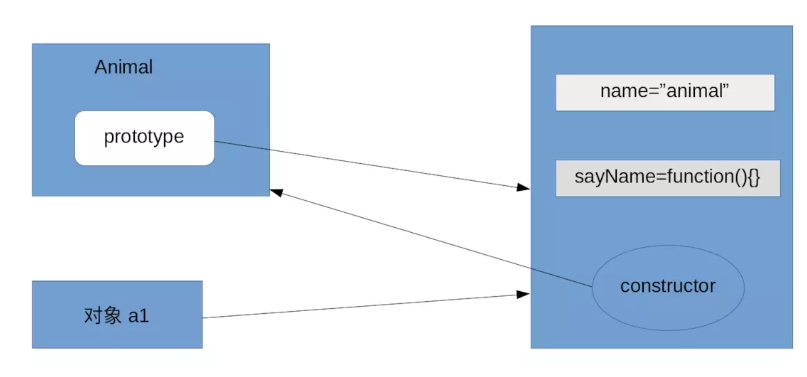
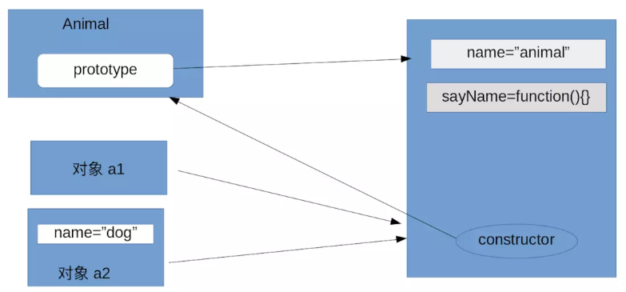
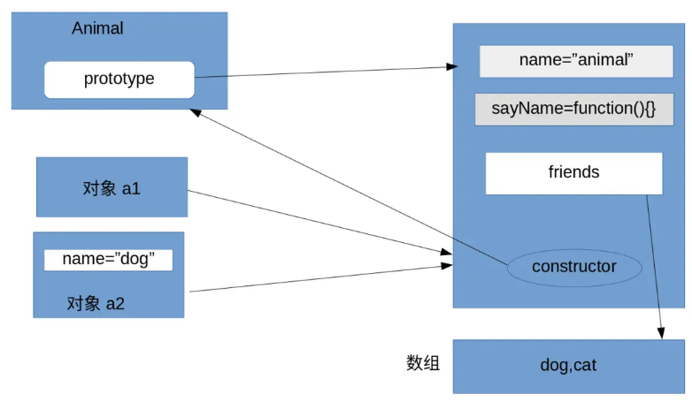
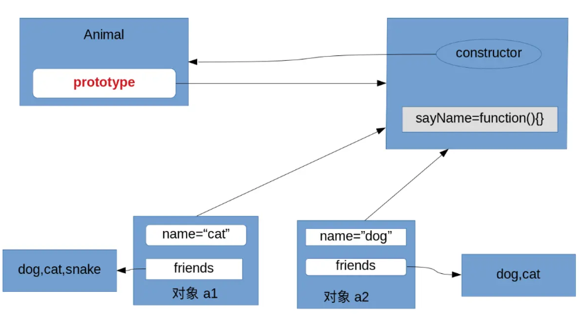
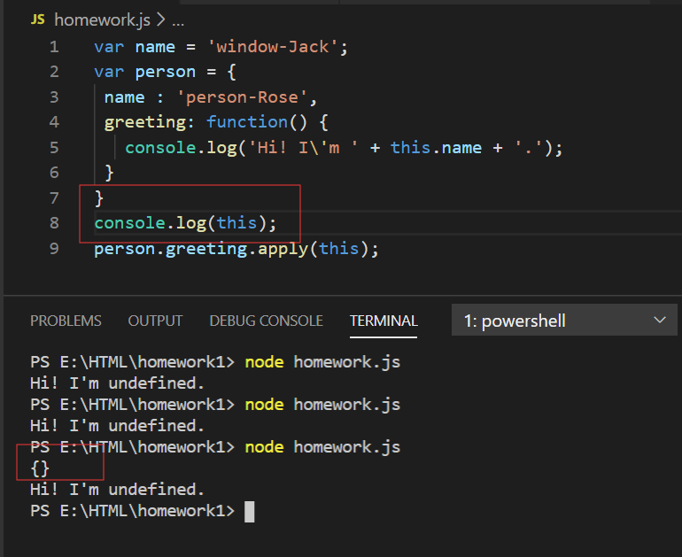
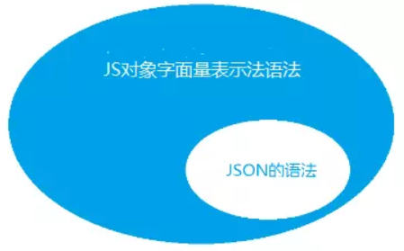
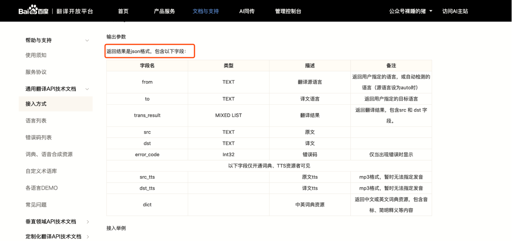
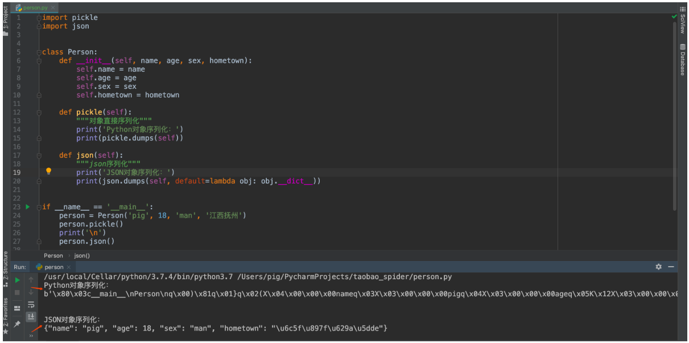
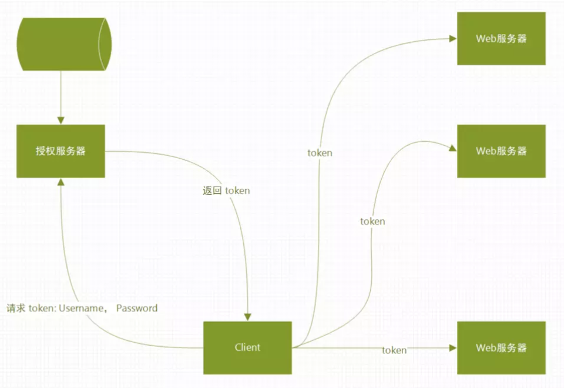

### Q 1 创建对象有哪些方式？

1、`{}`

2、`new Ｏbject()`

3、使用字面量

4、工厂模式

5、构造函数模式（constructor）

6、原型模式（prototype）

7、构造函数+原型模式

还有一些不常用的方式，如动态原型，寄生构造函数，稳妥构造函数。

**1、通过`{}`创建对象**

demo1：

```js
var obj = {};
obj.name = 'huxiao';
obj.num = '123';
obj.sayName = function() {
    alert(this.name);
};
```

**2、通过`new Ｏbject()`创建对象**

demo2:

```js
var obj = new Object();
obj.name = 'hu';
obj.num = '123';
obj.sayName = function() {
    alert(this.name);
};
```

**3、使用字面量**

demo3:

```js
var person = {name:'zhang',age:20}
```

>  **小结：** 前面三种创建对象的方式存在2个问题：1.代码冗余； 2.对象中的方法不能共享，每个对象中的方法都是独立的。

**4、工厂模式**

demo4:

```js
function createObject(name){
  var o = new Object();
  o.name = name;
  o.sayName = function(){
      alert(this.name);
  };
  return o;
};
var o1 = createObject('zhang');
var o2 = createObject('li');
```

该方法使用一个函数创建对象，减少重复代码，解决了前面三种方式的代码冗余的问题，但是该方法不能解决共享问题

**5、构造函数模式（constructor）**

demo5:

```js
function Person(name){
  this.name = name;
  this.sayName = function(){
      alert(this.name);
  };
};

var p1 = new Person('zhang');
var p2 = new Person('li');
```

构造函数的名称首字母大写，该方法是利用`new 构造函数`来创建对象。

内存模型：



通过内存模型，可以发现，`sayName`函数是独立存在于每个对象的，所以`p1.sayName===p2.sayName`结果为`false`，还是没有解决方法不能共享的问题。

**6、原型模式（prototype）**

每个方法都有一个原型`prototype`，每个原型都有一个构造器`constructor`，构造器又指向这个方法。

demo6:

```js
function Animal() { };

Animal.prototype.name = 'animal';
Animal.prototype.sayName = function () { alert(this.name); };

var a1 = new Animal();
var a2 = new Animal();

a1.sayName();

alert(a1.sayName === a2.sayName);//true
alert(Animal.prototype.constructor);//function Animal(){}
alert(Animal.prototype.constructor == Animal);//true

```

通过原型创建对象，把属性和方法绑定到`prototype`上，通过这种方式创建对象，方法是共享的，每个对象调用的是同一个方法。



如果往新建的对象中加入属性，那么这个属性是放在对象中，如果存在与原型同名的属性，也不会改变原型的值。但是访问这个属性，拿到的是对象的值。

访问的顺序：对象本身>构造函数的prototype

如果对象中没有该属性，则去访问prototype，如果prototype中没有，继续访问父类，直到Object，如果都没有找到，返回undefined

demo7:

```js
function Animal() { };
Animal.prototype.name = 'animal';
Animal.prototype.sayName = function () { alert(this.name); };

var a1 = new Animal();
var a2 = new Animal();
a1.sayName();
alert(a1.sayName === a2.sayName);//true
alert(Animal.prototype.constructor);//function Animal(){}
//修改a2.name，a1的name不会变
a2.name = 'dog';
a2.sayName();//dog
a1.sayName();//animal
```



这种方式创建的对象会存在问题，假如原型中包含有引用类型(相当于指针)的属性，那么如果某个对象修改了该属性的值，所有的该原型创建的对象访问的值都会改变。

demo7:

```

function Animal() { };
Animal.prototype = {
  name: 'animal',
  friends: ['dog', 'cat'],
  sayName: function () {
    alert(this.name);
  }
};
var a1 = new Animal();
var a2 = new Animal();
a2.friends.push('snake');
alert(a2.friends);//[dog,cat,snake]
alert(a1.friends);//[dog,cat,snake]
```




**7、构造函数+原型模式**

这种方式结合了上面两种方式，解决了代码冗余，方法不能共享，引用类型改变值的问题

```
function Animal(name) {
  this.name = name;
  this.friends = ['dog', 'cat'];
};
Animal.prototype.sayName = function () {
  alert(this.name);
};
var a1 = new Animal('d');
var a2 = new Animal('c');
a1.friends.push('snake');
alert(a1.friends);//[dog,cat,snake]
alert(a2.friends);//[dog,cat]
```



### Q 2 编程程序，完成下列需求：

> - 创建一个空对象，变量名为 user；
> - 添加一个 name 属性，并设置值为 John；
>
> - 添加一个 surname 属性，并设置其值为 Mike；
> - 将 name 属性的值改为 Peter;
> - 删除 user 的 name 属性；

代码如下：

```
var user = {};
user.name = "John";
user.surname = "Mike";

console.log(user.name);//John
user.name = "Peter";
console.log(user.name);//Peter
delete user.name;
console.log(user.name);//undefined
```

### Q 3 代码如下：

```
var a = {
   name: "xiaoming",
   age: 32  
};
var b = a;
b.age = 18;
console.log(a.age); // 打印出什么值？为什么？
```

结果是：`18`,因为对象属于引用类型，即对象的地址存储在栈中，值存储在堆中，当a对象赋值给b时，其实是让b和a指向同一块内存，所以当b改变了对象的age属性时，a的age属性的值也发生了改变。

### Q 4 有如下几段，请分别指出代码中 console 打印的值和为什么打印该值？

```
var name = 'window-Jack';
var person = {
 name : 'person-Rose',
 greeting: function() {
   console.log('Hi! I\'m ' + this.name + '.');
 }
}
var greeting = person.greeting;
greeting();
```

结果是:`Hi! I'm underfined.` 因为变量`greeting`指向`person`对象的`greeting`属性，该对象属性也是一个对象，所以this指向的是`greeting`对象，而该对象里面没有name属性，所以是`underfined`。这里有另外一个问题，为什么不是报错，而是`underfined`? 

```
var name = 'window-Jack';
var person = {
 name : 'person-Rose',
 greeting: function() {
   console.log('Hi! I\'m ' + this.name + '.');
 }
}
var greeting = person.greeting.bind(person);
greeting();
```

结果是:`Hi! I'm person-Rose.`  bind可以改变this指向， bind(person)之后，`this`指向了`person`对象，所以`this.name = person-Rose；`

```
var name = 'window-Jack';
var person = {
 name : 'person-Rose',
 greeting: function() {
   console.log('Hi! I\'m ' + this.name + '.');
 }
}
person.greeting.apply(this);
```

结果是 :`Hi! I'm undefined.` 这里this是个空对象，apply可以改变this的指向，所以使person.greeting指向了空对象，所以是undefined,下面是证明this是空对象，但是不理解为什么是空对象？



```
var name = 'window-Jack';
var person = {
 name : 'person-Rose',
 greeting: function() {
   console.log('Hi! I\'m ' + this.name + '.');
 }
}
person.greeting.call(this);
```

结果是 :`Hi! I'm undefined.` 

**解析**：和apply一样的解释

### Q 5 编写程序，实现下列需求：计算下面 fruit 对象共有多少个水果，应该输出 50。

```
var fruit = {
   apple: 20,
   pear: 20,
   peach: 10
};
// write your code here...

var count = fruit.apple + fruit.pear + fruit.peach;
console.log(count);//50
```

### Q 6 什么是 JSON？JSON 和 JavaScript 的关系以及 JSON 的适用场景是什么？

**JSON是什么**

JSON(JavaScript Object Notation)JavaScript对象表示法，是一种轻量级的数据交换格式。

类似XML,可以把JSON看作是一种存储数据的格式类型，一种数据规范。

JSON的书写格式：

> 1、键值对形式
>
> {
>   "person": {
>     "name": "pig",
>     "age": "18",
>     "sex": "man",
>     "hometown": {
>       "province": "江西省",
>       "city": "抚州市",
>       "county": "崇仁县"
>     }
>   }
> }
>
> **一个无序的“‘名称/值’对”集合。一个对象以 {左括号 开始， }右括号 结束。每个“名称”后跟一个 :冒号 ；“‘名称/值’ 对”之间使用 ,逗号 分隔**，。
>
> 2、数组形式
>
> ["pig", 18, "man", "江西省抚州市崇仁县"]
>
> 数组形式的JSON数据**就是值（value）的有序集合。一个数组以 [左中括号 开始， ]右中括号 结束。值之间使用 ,逗号 分隔。**

**JSON与JavaScript的关系**

既然JSON这种数据格式用JS对象字面量的表示方法进行描述，那么描述JSON的语法就是JS对象字面量表示法语法的一个子集。如下图所示：



```

//这是一个js对象,属性不加"",符合js对象的字面量表示法语法但不符合JSON语法。
var jsObj1 = {
  name: "张三"
}

//这是一个内部带有方法js对象，虽然属性加了"",但JSON的语法中属性的值不能是方法。
var jsObj2 = {
  "name": "张三",
  "func": function () {
    alert("hello");
  }
}


//这是一个符合JSON数据格式的js对象，是JavaScript语言中对JSON这种数据格式的实现形式，也是我们常说的"JSON对象"。
//这种JS对象字面量的表示方法，也就是"JSON对于其数据形式规范的语法"，所以说"JSON的语法就是JS对象字面量表示法语法的一个子集"。
var jsonObj = {
  "name": "张三",
  "age": 10,
  "remark": { "high": 170, "address": "beijinghaidian" }
}
```

其实对于"js对象的字面量表示法"中属性加不加引号是"js对象"还是"JSON对象的说法本身就是错误的，加与不加引号它都是"js对象",只是你加了引号以后，从语法上来说符合JSON的语法规则，而JSON的语法规则又是"js对象的字面量表示法"语法规则的子集，所以无论怎么表示，他都是一个"js对象"。那么有没有属性必须要加引号的情况呢？我们知道js对于变量的命名规则是数字、字母、下划线及$符号，属性不加引号时也符合这个规则，但要是属性中有这四种之外其它的符号如"[" 或者 "."等等，属性就必须引号来表示。

说到底，JSON是一种数据格式，一种对于数据的规范，因为其居有自我描述性及简洁的语法规则，让它成为了一种在不同语言之间理想的数据交换的格式，JSON独立于语言而存在，任何站在语言的角度及对象层面对他的解释都是有局限性或者是错误的。

**JSON的适用场景**

1、接口返回数据

JSON用的最多的地方莫过于Web了，现在的数据接口基本上都是返回的JSON，具体细化的场景有：

> 1. Ajxa异步访问数据
> 2. RPC远程调用
> 3. 前后端分离后端返回的数据
> 4. 开放API，如百度、高德等一些开放接口
> 5. 企业间合作接口

这种API接口一般都会提供一个接口文档，说明接口的入参、出参等，



2、序列化

程序在运行时所有的变量都是保存在内存当中的，如果出现程序重启或者机器宕机的情况，那这些数据就丢失了。一般情况运行时变量并不是那么重要丢了就丢了，但有些内存中的数据是需要保存起来供下次程序或者其他程序使用。

保存内存中的数据要么保存在数据库，要么保存直接到文件中，而**将内存中的数据变成可保存或可传输的数据的过程叫做序列化**，在Python中叫pickling，在其他语言中也被称之为serialization，marshalling，flattening等等，都是一个意思。

正常的序列化是将编程语言中的**对象直接转成可保存或可传输的，这样会保存对象的类型信息，而JSON序列化则不会保留对象类型！**



1. Python对象直接序列化会保存class信息，下次使用loads加载到内存时直接变成Python对象。
2. JSON对象序列化只保存属性数据，不保留class信息，下次使用loads加载到内存可以直接转成dict对象，当然也可以转为Person对象，但是需要写辅助方法。

对于JSON序列化不能保存class信息的特点，那JSON序列化还有什么用？答案是当然游有用，对于不同编程语言序列化读取有用，比如：**我用Python爬取数据然后转成对象，现在我需要将它序列化磁盘，然后使用Java语言读取这份数据，这个时候由于跨语言数据类型不同，所以就需要用到JSON序列化。**

存在即合理，两种序列化可根据需求自行选择！

3、生成Token

首先声明Token的形式多种多样，有JSON、字符串、数字等等，只要能满足需求即可，没有规定用哪种形式。

JSON格式的Token最有代表性的莫过于JWT（JSON Web Tokens）。

随着技术的发展，分布式web应用的普及，通过Session管理用户登录状态成本越来越高，因此慢慢发展成为Token的方式做登录身份校验，然后通过Token去取Redis中的缓存的用户信息，随着之后JWT的出现，校验方式更加简单便捷化，无需通过Redis缓存，而是直接根据Token取出保存的用户信息，以及对Token可用性校验，单点登录更为简单。



使用JWT做过app的登录系统，大概的流程就是：

> 1. 用户输入用户名密码
> 2. app请求登录中心验证用户名密码
> 3. 如果验证通过则生成一个Token，其中Token中包含：用户的uid、Token过期时间、过期延期时间等，然后返回给app
> 4. app获得Token，保存在cookie中，下次请求其他服务则带上
> 5. 其他服务获取到Token之后调用登录中心接口验证
> 6. 验证通过则响应

JWT登录认证有哪些优势：

> 1.  性能好：服务器不需要保存大量的session
> 2. 单点登录（登录一个应用，同一个企业的其他应用都可以访问）：使用JWT做一个登录中心基本搞定，很容易实现。
> 3. 兼容性好：支持移动设备，支持跨程序调用，Cookie 是不允许垮域访问的，而 Token 则不存在这个问题。
> 4. 安全性好：因为有签名，所以JWT可以防止被篡改。

4、配置文件

最具代表性的就是npm的package.json包管理配置文件了，下面就是一个npm的package.json配置文件内容。

但其实**JSON并不合适做配置文件，因为它不能写注释、作为配置文件的可读性差等原因。**

配置文件的格式有很多种如：toml、yaml、xml、ini等，目前很多地方开始使用yaml作为配置文件。

### Q 7 阅读推荐链接的文章，复习 JavaScript 对象基础，并总结为一篇文章，发布到**简书**上，并贴上链接。

 https://www.jianshu.com/p/5d455db15794